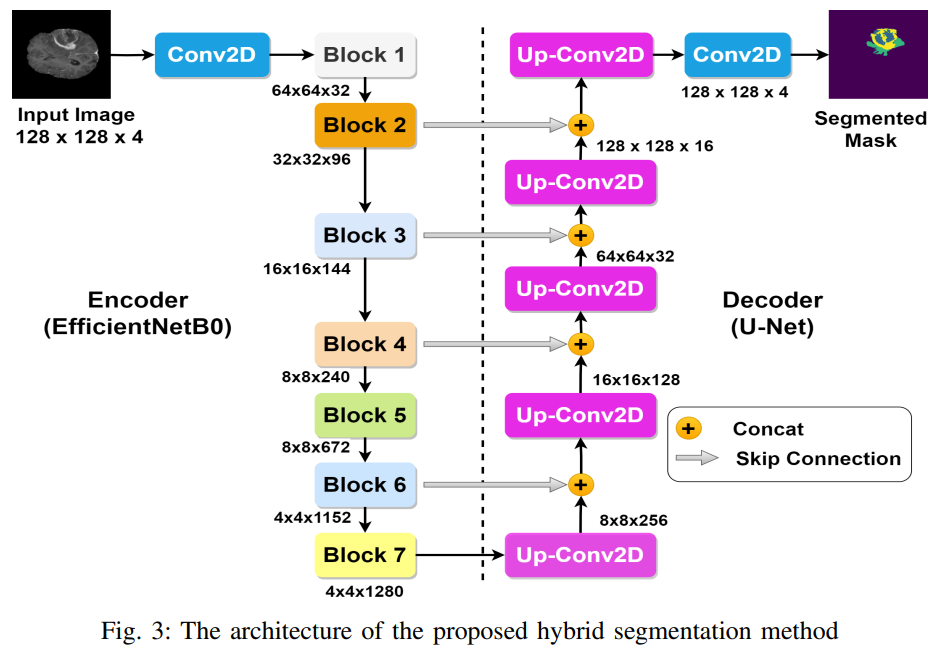

# A  Hybrid Multiclass Brain Tumor Segmentation Method Combining EfficientNet and U-Net
Code of th hybridization of  EfficientNet and U-Net in multiclass brain tumor segmentation method

Dataset Link: https://www.kaggle.com/datasets/awsaf49/brats20-dataset-training-validation

Main Paper Link (IEEE Xplorer): https://ieeexplore.ieee.org/document/11022614

Get Full Access from ResearchGate: https://www.researchgate.net/publication/392564194_A_Hybrid_Multiclass_Brain_Tumor_Segmentation_Method_Combining_EfficientNet_and_U-Net

  

Abstract: Brain tumors pose a significant threat, claiming numerous lives each year. Timely detection is essential for improving patient outcomes and optimizing treatment strategies. Accurate segmentation of tumor regions is crucial for effective brain tumor treatment. However, manual segmentation is a complex and time-consuming process that requires the expertise of professional radiologists. Therefore, automating the segmentation process is essential to accelerate treatment procedures while ensuring precision. This paper explores and evaluates the efficiency of a novel hybrid segmentation architecture designed for multiclass brain tumor segmentation, integrating EfficientNet with U-Net for magnetic resonance imaging (MRI). The customization is applied solely to the encoder portion of the U-Net, while the decoder portion maintains the original UNet architecture. The model is trained and validated using the BraTS 2020 dataset, which includes three distinct classes. The proposed approach outperforms existing popular segmentation models, achieving an accuracy of 99.2%, an IoU of 0.665, and a Dice Coefficient of 0.723 on test data. These results indicate that this method has the potential to advance brain tumor segmentation using multi-modal MRI images, thereby making a significant contribution to a more sophisticated understanding and diagnosis.
